<!-- ===== THEME-AWARE HERO BANNER ===== -->
<!-- GitHub automatically shows dark.svg in dark mode and light.svg in light mode -->

<picture>
  <source media="(prefers-color-scheme: dark)" srcset="dark.svg">
  <source media="(prefers-color-scheme: light)" srcset="light.svg">
  
</picture>

<!-- ===== GITHUB STATS ===== -->

<div align="center">

<!-- Streak - full width -->
<picture>
  <source media="(prefers-color-scheme: dark)" srcset="https://streak-stats.demolab.com/?user=yaiuhxr&hide_border=true&background=0A101F&stroke=22D3EE&ring=A78BFA&fire=10B981&currStreakLabel=22D3EE&sideLabels=94A3B8&currStreakNum=F8FAFC&sideNums=F8FAFC&dates=64748B&titleColor=22D3EE" />
  
</picture>

<br/>

<!-- Stats + Top languages - side by side -->
<picture>
  <source media="(prefers-color-scheme: dark)" srcset="https://github-readme-stats-sigma-rosy-28.vercel.app/api?username=yaiuhxr&show_icons=true&count_private=true&include_all_commits=true&hide_rank=true&hide_border=true&title_color=22D3EE&icon_color=A78BFA&text_color=94A3B8&bg_color=0A101F" />
  
</picture>
<picture>
  <source media="(prefers-color-scheme: dark)" srcset="https://github-readme-stats-sigma-rosy-28.vercel.app/api/top-langs/?username=yaiuhxr&layout=compact&langs_count=8&hide_border=true&title_color=22D3EE&text_color=94A3B8&bg_color=0A101F" />
  
</picture>

</div>

<!-- ===== CONTRIBUTION SNAKE ===== -->

<div align="center">

<picture>
  <source media="(prefers-color-scheme: dark)" srcset="https://raw.githubusercontent.com/yaiuhxr/yaiuhxr/output/snake-dark.svg" />
  <source media="(prefers-color-scheme: light)" srcset="https://raw.githubusercontent.com/yaiuhxr/yaiuhxr/output/snake-light.svg" />
  
</picture>

</div>

<!-- ===== END SNAKE ===== -->

<br/>
<br/>

<!-- ===== FEATURED PROJECTS PANEL ===== -->

<div align="center">

</div>

<br/>

<!-- ===== ABOUT ME ===== -->

### 💫 About Me

> *"Enthusiastic AI & Machine Learning student with solid expertise in Python, Data Structures, Algorithms, and ML problem-solving. Passionate about building intelligent, scalable systems and applying machine learning to solve real-world challenges."*

```text
⚡ Quick Overview
├── 🎓 Major               : Artificial Intelligence & Machine Learning (Sem-4)
├── 🏫 Institution         : Vidya Vardhini Bhausaheb Vartak Polytechnic, Mumbai (CGPA: 8.95)
├── 🔭 Current Focus       : Machine Learning Pipelines & Intelligent Automation
├── 🧠 Core Strengths      : Python, Data Structures, Algorithms & Problem Solving
└── 🌱 Currently Learning  : Deep Learning Architectures & MLOps
```

---

<!-- ===== TECH STACK ===== -->

### 💻 Tech Stack & Tools

<details open>
  <summary><b>🚀 Programming Languages</b></summary>
  <br/>
  
  
  
  
  
  
</details>

<br/>

<details open>
  <summary><b>🤖 Data Science & Machine Learning</b></summary>
  <br/>
  
  
  
  
</details>

<br/>

<details open>
  <summary><b>🗄️ Databases & Tools</b></summary>
  <br/>
  
  
  
  
  
</details>

<br/>

<!-- ===== SOCIAL BADGES ===== -->

<div align="center">

<a href="https://linkedin.com/in/yadnesh-gawali" target="_blank">
  
</a>
&nbsp;&nbsp;
<a href="https://instagram.com/the.yadnesh.gawli" target="_blank">
  
</a>
&nbsp;&nbsp;
<a href="https://github.com/yaiuhxr" target="_blank">
  
</a>
&nbsp;&nbsp;
<a href="mailto:yadneshgawali68@gmail.com">
  
</a>

<br/><br/>


</div>

<!-- ===== END SOCIAL BADGES ===== -->
